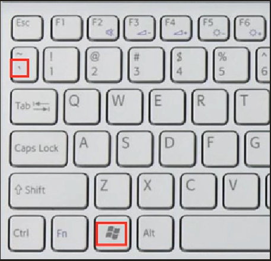
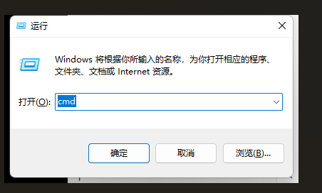
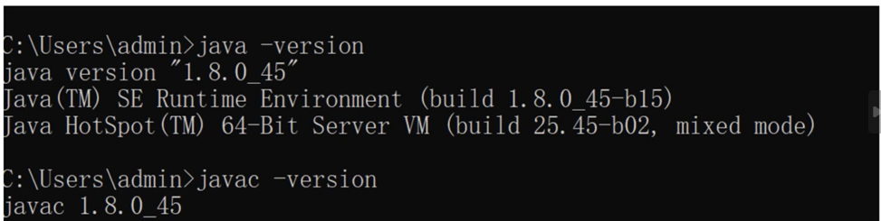
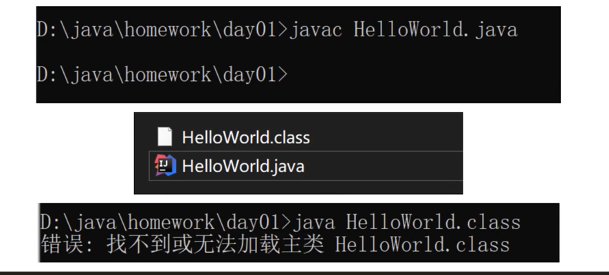
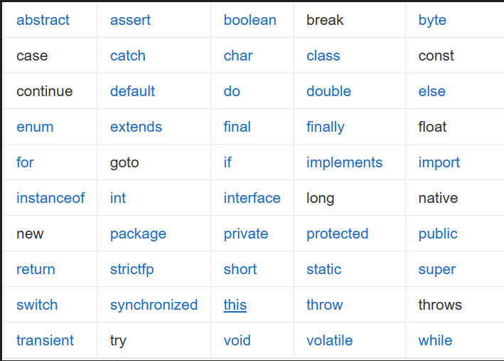

# dos 命令讲解以及系统快捷键

## 1.键盘介绍




## 2. dos 命令讲解

```java
win + r    //打开cmd  
ipconfig   //查看ip  
cls        //清屏  
ping       //查看主机通不通  
盘符：     //去对应的盘符  
cd ./tools //去某一个文件夹
```

## 3.系统常用快捷键

```java
win + r //打开我的电脑  
win + d //回到桌面  
win + l //锁屏  
Alt + Tab //切屏  
Ctrl + a //全选
```





---

# JDK了解与安装

## 1.概念

JDK是 [Java](https://baike.baidu.com/item/Java/85979) 语言的[软件开发工具包](https://baike.baidu.com/item/%E8%BD%AF%E4%BB%B6%E5%BC%80%E5%8F%91%E5%B7%A5%E5%85%B7%E5%8C%85/10418833)，主要用于[移动设备](https://baike.baidu.com/item/%E7%A7%BB%E5%8A%A8%E8%AE%BE%E5%A4%87/9157757)、[嵌入式设备](https://baike.baidu.com/item/%E5%B5%8C%E5%85%A5%E5%BC%8F%E8%AE%BE%E5%A4%87/10055189)上的java[应用程序](https://baike.baidu.com/item/%E5%BA%94%E7%94%A8%E7%A8%8B%E5%BA%8F/5985445)。JDK是整个java开发的核心，它包含了JAVA的[运行环境](https://baike.baidu.com/item/%E8%BF%90%E8%A1%8C%E7%8E%AF%E5%A2%83/6555199)（[JVM](https://baike.baidu.com/item/JVM/2902369)+Java系统[类库](https://baike.baidu.com/item/%E7%B1%BB%E5%BA%93/3351433)）和JAVA工具。

## 2.JDK安装

```java
1.注意编译安装JRE，JDK已经包含JRE 2.环境变量的配置

1.此电脑-右键属性-高级系统设置-环境变量-配置JAVA_HOME-配置path-%JAVA_HOME%/bin  
​  
2.测试 java -version   java -version       
```



---

# 第一个Java程序 HelloWorld

## 1.加载与执行过程

```java
java 源文件 → javac 编译 → java 字节码文件 → 运行
```

## 2.HelloWorld

```java
public class HelloWorld{  
    public static void main(String[] args){  
       System.out.prinlt("HelloWorld");  
    }  
}  
​  
//tab cmd命令框中 自动补全  
​  
//编译 javac HelloWorld.java  
//运行 java HelloWorld
```




## 3.常见错误

-   单词写错
-   运行Java的时候，Java类名，不能加上class。

## 4.HelloWorld代码块

### 1.最外层是类

```java
public class HelloWorld{  
​  
}
```

### 2.主方法程序入口

```java
public static void main(String[] agrs){  
​  
}
```

### 3.输出语句

```java
System.out.println("HEelloWorld");
```

---

# Java注释

## 1.注释

**写源代码的时候，需要一些文字说明，使用注释来辅助说明（在使用的时候，编译器会忽略它的存在）**

```java
单行注释： //内容  
多行注释： /* 注释 */  
文档注释： /** 内容 */
```

```java
/*  
 *这是一个注释demo类  
 */  
public class Demo{  
	//主方法程序入口  
	public static void main(String[] args){  
		/**  
		* 输出语句  
		*/  
		System.out.println("Demo");  
	}  
}
```

## 2.关键字

**Java关键字是对Java编译器有特殊含义的[字符串](https://baike.baidu.com/item/%E5%AD%97%E7%AC%A6%E4%B8%B2/1017763)，是编译器和程序员的一个约定，程序员利用关键字来告诉编译器其声明的变量类型、类、方法特性等信息。Java语言共定义了如下所示的关键字。**



## 3.标识符

其实就是名称，定义类，包，方法，变量名。为了一个好的命名

### 标识符的组成

-   **英文大小写字母 （A-Z a-z）**
    
-   **数字 0-9**
    
-   **符号_与￥**
    

### 标识符的规则

-   **不能使用数字为开头**
    
-   **不能使用关键字**
    
-   **严格区分大小写，要做到见名知意**
    
-   **驼峰命名法**
    

```java
//这是一个测试程序  
public class Test{  
  
}  
  
/*  
* 见名知意  
*/  
public class StudentTest{  
  
}
```