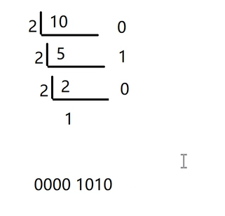
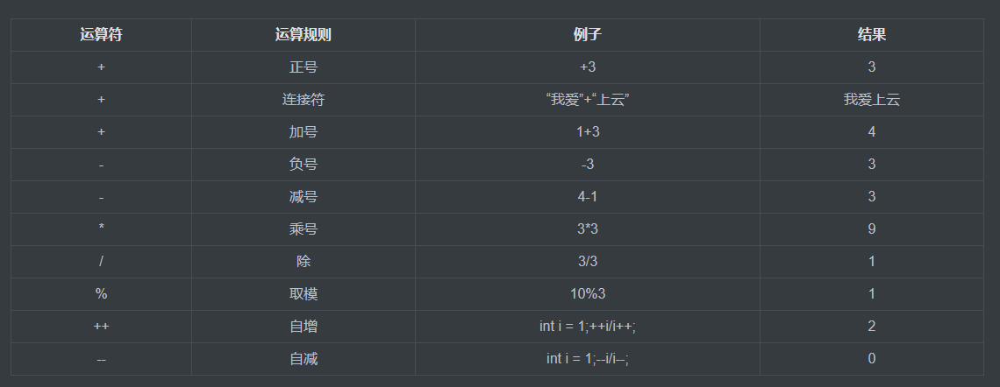
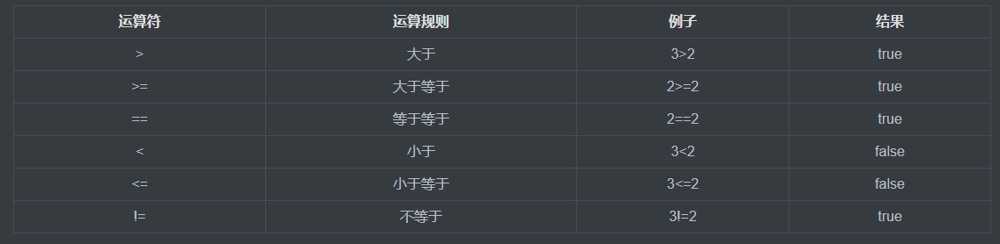
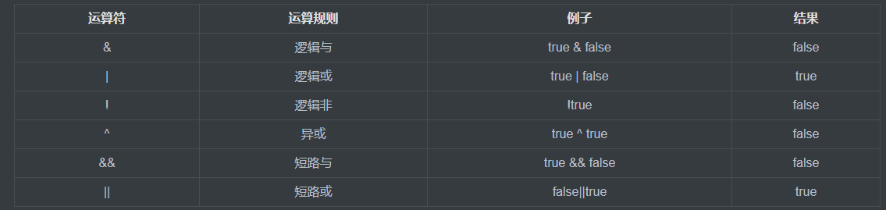
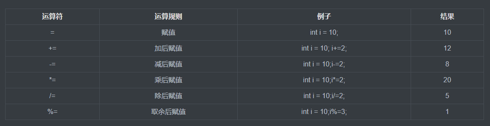

# 1. 基础语法

## 1. 计算机存储单元

* 1.什么是字节：计算机最小的存储单元（水杯）----bit（位，比特位）

* 2.其他的存储单位：
```java
   1B（字节）= 8 bit
   1KB       = 1024（B）
   1MB       = 1024KB
   1GB       =  1024MB
```

## 2. 进制

* 1.十进制：10 12 15

* 2.二进制：1010 1000 ，0010 0010

* 3.需求 ： 10转换成二进制

  
# 2. 数据类型 🚩

## 1. 基本数据类型

### 1.整形 🚩

**演示整形的Demo**

#### 1.byte 🚩
存储范围 =  [ -128 - 127 ]
存储字节 = 1 字节  =  8 位
```java
public class ByteDemo{
	public static void main(String[] args){
		byte b = 12;
		System.out.println(b);
	}
}

//如果我们 存200
```

#### 2.Short
存储范围 =  [ -32768 - 32767 ]
存储字节 = 2 字节  =  16 位
```java
public class ShortDemo{
	public static void main(String[] args){
	Short sh = 12;
		System.out.println(sh);
	}
}
```

#### 3.Int 🚩
存储范围 =  [ -2147483648 - 2147483648 ]
存储字节 = 4 字节  =  32 位
```java
public class IntDemo{
	public static void main(String[] args){
	Int in = 12;
		System.out.println(in);
	}
}
```

#### 3.Long 🚩
存储范围 =  [ -2^63 - 2^63-1 ]
存储字节 = 8 字节  =  64 位
```java
public class LongDemo{
	public static void main(String[] args){
	Long lo = 12;
		System.out.println(lo);
	}
}
```


### 2.浮点型

**演示浮点型的Demo**
#### 1.DouBle
存储字节 = 8 字节  
```java
public class DouBleDemo{
	public static void main(String[] args){
	Double dou = 12.5D;
		System.out.println(dou);
	}
}
```

#### 2.Float
存储字节 = 4 字节  
```java
public class FloatDemo{
	public static void main(String[] args){
	Float floa = 12.6F;
		System.out.println(floa);
	}
}
```


### 3.字符型

**演示字符型的Demo**
#### 1.Char
存储字节 = 2 字节  
```java
public class CharDemo{
	public static void main(String[] args){
	Char char = '男';
		System.out.println(char);
	}
}
```

### 4.布尔型 🚩

**演示布尔的Demo**
#### 1.Boolean
存储字节 = 1 字节
True/False
```java
public class BooleanDemo{
	public static void main(String[] args){
	Boolean b = ture;
		System.out.println(b);
	}
}
```


## 2. 引用数据类型（了解）

### 1.String的简单使用

**String的基本学习Demo**
```java
public class StringDemo{
	public static void main(String[] args){
		Strng str = "学习使用String";
		System.out.println(str);
	}
}
```

## 3. 基本数据强制类型转换

### 1.(Int)Float

**演示浮点型（Float）强制转换整型（Int）**
```java
public class intTestF{
	public static void main(String[] args){
		Float f1 = 3.7F;
		int intTestF = (int)f1;
		System.out.println(intTestF);// intTestF = 3
	}
}
```

### 2.(Int)Double

**演示浮点型（Double）强制转换整型（Int）**
```java
public class Test{
	public static void main(String[] args){
		Double d1 = 1.2d;
		int intTestD = (int)d1; 
		System.out.println(intTestD);// intTestF = 1
	}
}
```


### 3.注意事项

 1.相互转换
```java
8种类型中除了布尔类型之外，剩下的7种类型之间都可以相互转换
```

 2.容量从小到大
  ```java
  小容量转换成大容量成为自动类型转换，容量从小到大的排序
  byte < short(char) < int < long < float < double  
```

 3.容量从大到小
```java
大容量转换成小容量成为强制类型转换，需要加强制类型转换符，编译通过。执行过程中可能会损失精度，谨慎使用
```

 4.取值范围
```java
整数型字面量（取值范围）没有超出Byte，Short，Char的取值范围，可以直接赋值
```

 5.混合运算
```java
Byte，Short，Char混合运算时，各自先转换成 Int 类型在做运算
```

 6.多种数据类型混合运算
```java
多种数据类型混合运算时，各自先转换成容量最大的在做运算
```


## 4.常量 🚩

**概念：永远不会变的量（默认是 Int 类型）**

**相关关键词：Final**
```java
public class ConstantDemo{
	public void main(String[] args){
		//常量
		final int i = 10;
		}
}
```

## 5.变量 🚩

### 定义格式
```java
数据类型 变量名  赋值符号  数值
  int      i       =        10;
```

### 代码演示
```java
public class VatiableDemo{
	public static void main(String[] args){
		double d = 3.5;
		d = 3.6;
		System.out.println(d);

		String str = "上云";
		str = "上云17";
		System.out.println(str);
	}
}
```

**==如果给 final 修饰的变量赋值，就会报错，已经变成了常量了==** 🚩


```java
		final int i = 10;
		i = 20;
		Syste.out.println(i);
```


## 6.运算符 🚩

### 1.算术运算符
```java
 +  -  *  /  %  ++  --
```




**演示操作运算符**
**==注意：前置 ++ 和后置 ++ 的区别，前置 ++ 先+1在运算，后置 ++先运算再+1==**
```java
public class OperatorDemo{
	// 演示 +  -  *  /  %  
	public static void main(Stringp[] args){
		int a = 10;
		int b = 20;
		System.out.println(a + b); //30
		System.out.println(a - b); //-10
		System.out.println(a * b); //200
		System.out.println(a / b); //0

        a = 3;
		System.out.println(a % b);//2

        System.out.println("-----------分割线演示后置 ++ ------------");   
    // 演示++  --   
	    int c = 5;
	    c++;
	    System.out.println(c); //5

		c--;
		System.out.println(c); //6
		System.out.println("-----------分割线演示前置 ++ ------------");

	    int d = 5;
	    ++d;
		--d;
		System.out.println(c); //5
		
		System.out.println("-----------分割线演示前置 ++ 与后置 ++ ------------");

        int f = 10;
        int e = 2
        
        int g = e++ + f;
	    //System.out.println(f + e); //13
		System.out.println(g); //13
		System.out.println(e); //3
	}
}
```

### 2.关系运算符
```java
> >= == != < <=
```



**演示关系运算符**
```java
public class RelationalDemo{
	// 演示 > >= == != < <=
	public static void main(String[] args){
		System.out.println(10 > 20);  //ture
		System.out.println(10 >= 20); //false
		System.out.println(10 == 20); //false
		System.out.println(10 != 20); //true
		System.out.println(10 < 20);  //true
		System.out.println(10 <= 20); //false
	}
}
```

### 3.逻辑运算符

```java
& | ! ^ && ||
```




**演示逻辑运算符**
```java
public class LogicallDemo{
	// 演示 & | ! ^ && ||
	public static void main(String[] args){
		boolean bo = false;
		boolean b1 = true;
		System.out.println( b0 & b1); //false
		System.out.println( b0 | b1); //true
		System.out.println( !b0);     //true

		System.out.println( b0 ^ b1);   //true
		System.out.println( b0 && b1);  //false
		System.out.println( b0 || b1);  //true
	}  
}
```

### 4.三目运算符

**boolean?值1:值2；** **==前面为true 取值1 否则取值2==**
```java
int i3 = 10;
int i4 = 20;
int i5 = i3>i4?5:6;
System.out.println( i5 ); //6
```

### 5.赋值运算符
```java
基本赋值运算符: =
扩展赋值运算符: +=  -=  *=  /=  %=
对于扩展的赋值运算符，即使数据超出范围，最终也不会改变运算的结果类型
```




**演示赋值运算符**
```java
public class AssignmentDemo{
	public static void main(String[] args){
		//基本赋值运算符: =
		int a = 10;
		int b = a + 20;
		System.out,println(b); //30

		//扩展赋值运算符: +=  -=  *=  /=  %=
		a += a;
		System.out,println(a);//20
        int c = 20;
        System.out,ptintln(c -= 30); //-10
	}
}
```

**举例1**

虽然说是by与by1是Byte数据类型的数据，但是byte by2 = by + by1; 使用运算符 **==+==** 的时候，会默认  **==by + by1==**  的数据类型变成 **==Int 类型==**

**==Int类型的数据能给 Byte嘛？？！！==**
```java
//举例代码
public class AssignmentDemo{
	public static void main(String[] args){
		//byte short
		byte by = 10;
		byte by1 = 20;
		//默认的整型是 Int
		byte by2 = by + by1;
		System.out.println(by2);
	}
}
```

解决方案： 大范围到小范围（强制数据类型转换） (byte)(by + by1)
```java
//解决方案代码
public class AssignmentDemo{
	public static void main(String[] args){
		//byte short****
		byte by = 10;
		byte by1 = 20;
		//默认的整型是 Int
		byte by2 = (byte)(by + by1);
		System.out.println(by2);
	}
}
```


### 6.字符串连接运算符
```java
public class AssignmentDemo{
	public static void main(String[] args){
	    //字符串的连接
		String str1 = "我爱";
		String str2 = "兔子";
		System.out.println(str1 + str2); //我爱兔子
 
		//char码表对应 ASCII码
		char ch1 = 'a';
		char ch2 = 'b';
		System.out.println(ch1 + ch2); //192
	}
}
```


